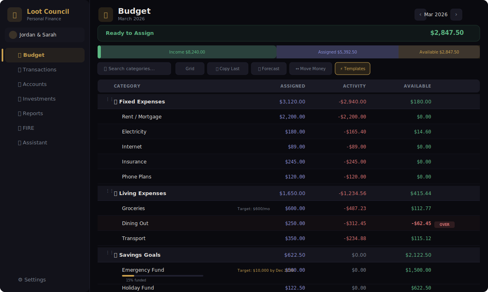
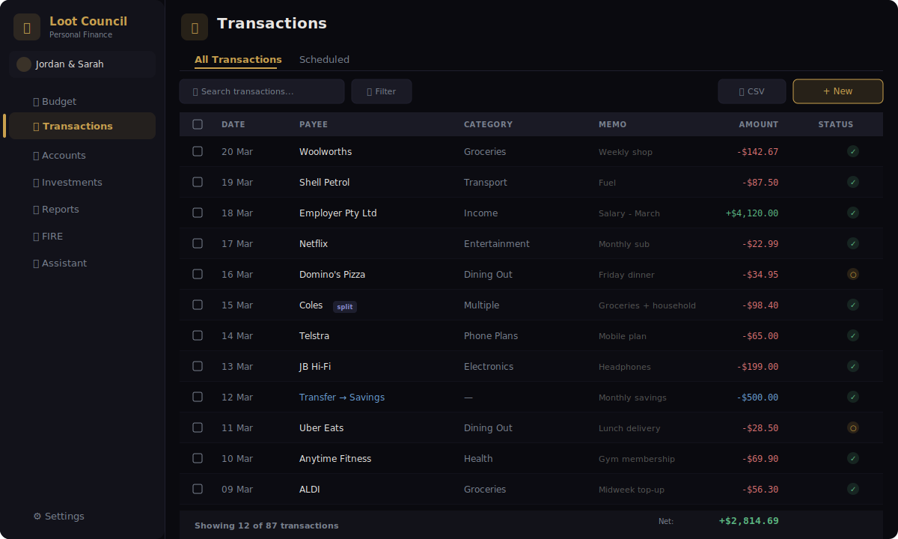
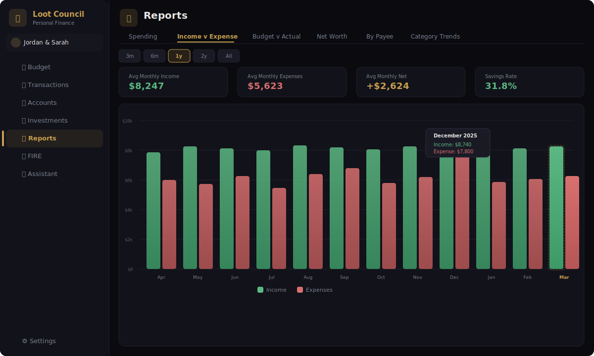
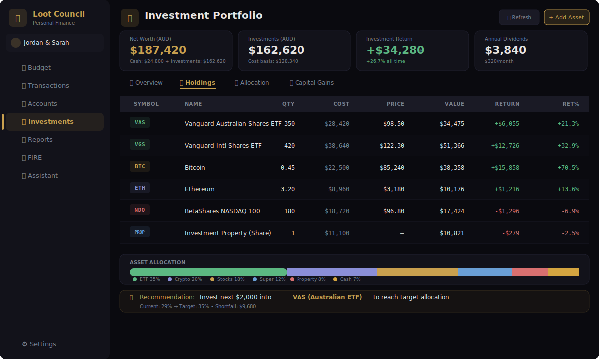
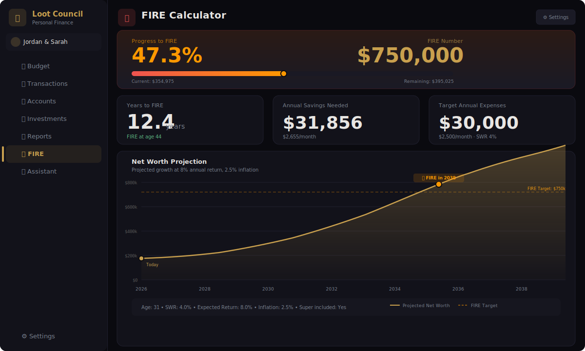

<div align="center">

# 💰 Loot Council

### *Zero-based budgeting that stays on your machine.*

**A local-first, privacy-focused personal finance app for running a complete household budget.**<br/>
Add or import your accounts, give every available dollar a job, keep transactions reconciled, and use reports to decide what to change next.

<br/>

[](https://github.com/AusSherro/LootCouncil/actions/workflows/ci.yml)

[](https://nextjs.org/)
[](https://www.typescriptlang.org/)
[](https://www.prisma.io/)
[](https://www.sqlite.org/)
[](https://tailwindcss.com/)
[](LICENSE)

<br/>

> 🔒 **Your data stays on your machine** — no cloud, no tracking, no subscriptions.

<br/>

---

</div>

## 📑 Table of Contents

- [How to Use Loot Council](#-how-to-use-loot-council)
- [Why Loot Council?](#-why-loot-council)
- [Features](#-features)
- [Tech Stack](#%EF%B8%8F-tech-stack)
- [Getting Started](#-getting-started)
- [Project Structure](#-project-structure)
- [Themes](#-themes)
- [Keyboard Shortcuts](#%EF%B8%8F-keyboard-shortcuts)
- [Database Schema](#-database-schema)
- [Contributing](#-contributing)
- [License](#-license)

---

## 🧭 How to Use Loot Council

Loot Council follows a simple loop: **load your real balances, plan the money you have, record what happens, then reconcile and review.**

1. **Choose a profile** — Open **Settings → Profiles** to create or select a household budget. Each profile keeps its accounts, transactions, categories, integrations, and settings separate.
2. **Load your finances** — Add accounts from **Accounts → Add Account**. To bring existing data across, use **Settings → Data Management** for a YNAB backup, the YNAB API, or a Loot Council JSON backup; use **Transactions → Import CSV** for transaction files.
3. **Build the budget** — On **Budget**, create category groups and categories, add optional goals, then enter each category's **Assigned** amount. Keep assigning until **Ready to Assign** reaches zero; only budget money you currently have.
4. **Keep the ledger current** — Use **Transactions → Add Transaction** (or press `N`) for new activity. Categorize each transaction, split it when needed, mark cleared items, and use the **Scheduled** tab for recurring bills or income.
5. **Reconcile accounts** — Open an account and choose **Reconcile**. Compare Loot Council's cleared balance with the bank, enter an adjustment if required, and finish the reconciliation so the ledger stays trustworthy.
6. **Review and improve** — Use the dashboard for the daily snapshot, **Reports** for spending and savings trends, **Investments** for assets, and **FIRE** for long-term scenarios. The optional **Assistant** can analyze local financial context only after you explicitly consent.

**Suggested routine:** add or import transactions as they occur, reconcile against each bank weekly, and assign new income from **Ready to Assign** whenever it arrives. At the start of a month, copy the previous budget or apply a template, adjust goals, and fund the new month.

> Amounts are stored locally in SQLite. Choose **Settings → Data Management → Export Backup** before major imports, resets, or moving the app to another machine.

---

## 💡 Why Loot Council?

Most budgeting apps want your data in their cloud and a monthly subscription fee. **Loot Council** takes a different approach:

| | Loot Council | Typical SaaS |
|---|:---:|:---:|
| **Data ownership** | ✅ 100% local | ❌ Their servers |
| **Subscription** | ✅ Free forever | ❌ $10-15/mo |
| **Privacy** | ✅ Zero telemetry | ❌ Data harvesting |
| **Offline access** | ✅ Works offline | ❌ Requires internet |
| **Open source** | ✅ MIT license | ❌ Proprietary |
| **YNAB methodology** | ✅ Full support | 🟡 Varies |
| **Investment tracking** | ✅ Built-in | ❌ Separate app |
| **FIRE calculator** | ✅ Built-in | ❌ Separate tool |

---

## 📸 Screenshots

<details open>
<summary><b>Budget — Zero-based envelope budgeting</b></summary>
<br/>
<p align="center">

</p>
</details>

<details>
<summary><b>Transactions — Full transaction ledger</b></summary>
<br/>
<p align="center">

</p>
</details>

<details>
<summary><b>Reports — Income vs Expense trends</b></summary>
<br/>
<p align="center">

</p>
</details>

<details>
<summary><b>Investments — Portfolio tracking with live prices</b></summary>
<br/>
<p align="center">

</p>
</details>

<details>
<summary><b>FIRE Calculator — Path to Financial Independence</b></summary>
<br/>
<p align="center">

</p>
</details>

---

## ✨ Features

<table>
<tr>
<td width="50%" valign="top">

### 💰 Core Budgeting
- **Envelope-style** zero-based budgeting
- "Ready to Assign" — give every dollar a job
- Split transactions across categories
- Transfer tracking between accounts
- **Budget transfers** between categories
- Reconciliation mode (cleared/reconciled)
- Age of Money metric
- **Budget flow bar** — income → assigned → available

</td>
<td width="50%" valign="top">

### ⚡ Smart Automation
- Auto-categorize via payee pattern rules
- Budget templates — save & reuse setups
- Quick actions — last month / average / underfunded
- Copy budgets from previous months
- Auto-assign to fund category goals
- Scheduled recurring transactions

</td>
</tr>
<tr>
<td width="50%" valign="top">

### 🎯 Goals & Tracking
- **Target Balance** — Save to a specific amount
- **Target by Date** — Deadline-based saving
- **Monthly Funding** — Fixed recurring amount
- **Spending Goal** — Plan expected spending
- **Debt Payoff** — Track debt reduction
- Visual progress bars & overspending alerts
- **Budget Forecast** — "Can I afford it?" projections with chart

</td>
<td width="50%" valign="top">

### 📈 Investment Portfolio
- Stocks, ETFs, crypto, property & super
- Multi-currency with AUD conversion
- Yahoo Finance & CoinGecko live prices
- Purchase lots with CGT tracking
- Asset allocation targets vs actual
- Binance wallet sync integration

</td>
</tr>
<tr>
<td width="50%" valign="top">

### 🔥 FIRE Calculator
- Years to Financial Independence
- Safe Withdrawal Rate (customizable)
- Coast FIRE & Barista FIRE modes
- Australian super integration
- Interactive sliders for scenario planning

</td>
<td width="50%" valign="top">

### 📊 Advanced Reports
- 8 report tabs — Spending Breakdown, Top Movers, Income v Expense, **Savings Rate**, Budget vs Actual, Net Worth, By Payee, Category Trends
- **Chart drill-down** — click any segment to jump to filtered transactions
- **Top Movers** — biggest category swings vs last month or last year
- **Savings Rate** — `(income − expense) / income` over time with 20% target
- Global "Exclude categories" filter, persisted per profile
- All-time historical data view

</td>
</tr>
<tr>
<td width="50%" valign="top">

### 🤖 AI Features <sup>optional</sup>
- Chat-based financial advisor
- AI-generated spending insights
- Budget optimization suggestions
- **Data consent** — explicit opt-in before sharing data

</td>
<td width="50%" valign="top">

### 📦 Data Management
- YNAB import (ZIP backup + API)
- CSV transaction import **+ CSV export**
- Full JSON backup & restore
- Payee management (merge/rename)
- Bulk transaction editing & pagination
- Date-range presets + filters persisted per profile
- **Multi-profile** — independent budgets per profile

</td>
</tr>
</table>

---

## 🏗️ Tech Stack

<table>
<tr>
<td align="center" width="96">

<br/><sub><b>Next.js 16</b></sub>
</td>
<td align="center" width="96">

<br/><sub><b>TypeScript 5</b></sub>
</td>
<td align="center" width="96">

<br/><sub><b>SQLite</b></sub>
</td>
<td align="center" width="96">

<br/><sub><b>Prisma 6</b></sub>
</td>
<td align="center" width="96">

<br/><sub><b>Tailwind 4</b></sub>
</td>
<td align="center" width="96">

<br/><sub><b>React 19</b></sub>
</td>
</tr>
</table>

<details>
<summary><b>Full dependency breakdown</b></summary>
<br/>

| Layer | Technology | Version | Purpose |
|-------|------------|---------|---------|
| Framework | Next.js (App Router + Turbopack) | 16.2.6 | Full-stack React framework |
| Language | TypeScript (strict mode) | 5.x | Type safety |
| Database | SQLite | — | Local-first data storage |
| ORM | Prisma | 6.19.2 | Database access & migrations |
| Styling | Tailwind CSS | 4.x | Utility-first CSS |
| Icons | Lucide React | 0.563.0 | Consistent icon system |
| Charts | Recharts | 3.7.0 | Data visualization |
| AI | OpenAI API | 6.17.0 | Financial advisor & insights |
| Stock Data | yahoo-finance2 | 3.13.0 | Stock prices & symbol lookup |
| Crypto Data | CoinGecko API | — | Cryptocurrency prices |
| Exchange Rates | exchangerate-api.com | — | Currency conversion |
| Crypto Sync | Binance API | — | Direct wallet sync |
| Spreadsheets | xlsx + jszip | 0.20.3 (SheetJS CDN) | YNAB import parsing |
| Drag & Drop | dnd-kit | 6.3.1 | Category reordering |

</details>

---

## 🚀 Getting Started

### Prerequisites

- **Node.js** 20+ ([download](https://nodejs.org/)) — matches the project's Docker image
- **npm** (bundled with Node.js)

### Quick Start

```bash
# 1. Clone the repository
git clone https://github.com/AusSherro/LootCouncil.git
cd loot-council

# 2. Install dependencies
npm install

# 3. Set up the database
npx prisma generate
npx prisma db push

# 4. Start the app
npm run dev
```

Open **[http://localhost:3000](http://localhost:3000)** to get started!

### ⚙️ Environment Variables

Create a `.env` file in the project root:

```env
# Required
DATABASE_URL="file:../data/loot-council.db"

# Optional — AI Features (OpenAI)
OPENAI_API_KEY="sk-..."

# Optional — Currency & Investments
HOME_CURRENCY="AUD"

# Optional — Binance Wallet Sync
BINANCE_API_KEY="..."
BINANCE_API_SECRET="..."
```

> 💡 The app works fully without any API keys — AI features and Binance sync are opt-in extras.

---

## 📁 Project Structure

```
loot-council/
├── prisma/
│   ├── schema.prisma         # Database schema (20 models)
│   └── migrations/           # Database migrations
├── data/                     # Local SQLite databases (gitignored)
├── scripts/                  # Test database preparation
├── src/
│   ├── app/
│   │   ├── api/              # 47 API routes across 26 top-level domains
│   │   │   ├── accounts/     # Account CRUD
│   │   │   ├── ai/           # AI features (chat, insights, optimize)
│   │   │   ├── budget/       # Budget operations (auto-assign, copy, transfer, quick-actions)
│   │   │   ├── categories/   # Category management
│   │   │   ├── transactions/ # Transaction CRUD (bulk, splits, transfers)
│   │   │   ├── investments/  # Portfolio (holdings, lots, prices, allocations)
│   │   │   ├── profiles/     # Multi-profile management
│   │   │   ├── fire/         # FIRE calculator
│   │   │   ├── binance/      # Binance wallet sync
│   │   │   ├── import/       # Data import (YNAB, CSV, backup)
│   │   │   ├── export/       # JSON backup export
│   │   │   └── ...           # + 15 more domains
│   │   ├── budget/           # Budget page
│   │   ├── transactions/     # Transactions page
│   │   ├── accounts/         # Accounts page
│   │   ├── reports/          # Reports page (8 tab components in _tabs/)
│   │   ├── investments/      # Portfolio page
│   │   ├── fire/             # FIRE calculator page
│   │   ├── settings/         # Settings page (with profiles)
│   │   └── assistant/        # AI assistant page
│   ├── components/           # 32 React components
│   ├── lib/                  # Utilities, hooks, helpers, and tests (18 files)
│   └── generated/            # Prisma client (auto-generated)
└── public/                   # Static assets
```

---

## 🎨 Themes

Finance is the clean, professional default. Six optional themes are available for a more personal look — switch anytime under **Settings → Appearance**.

| Theme | Style | Accent |
|-------|-------|:------:|
| 💼 **Finance** *(default)* | Clean, professional light theme | `#2563EB` |
| 🌑 **Dungeon** | Dark with gold accents | `#D4A846` |
| 🌿 **Forest** | Earthy greens | `#7CB342` |
| 🌊 **Ocean** | Deep blues | `#4FC3F7` |
| 🔴 **Crimson** | Bold reds | `#EF5350` |
| 👑 **Royal** | Rich purples | `#AB47BC` |
| 🌸 **Kawaii** | Warm pinks | `#FF6B9D` |

---

## ⌨️ Keyboard Shortcuts

Press <kbd>?</kbd> anywhere in the app to see this list.

**Global**

| Shortcut | Action |
|:---------|:-------|
| <kbd>G</kbd> then <kbd>B</kbd> / <kbd>T</kbd> / <kbd>A</kbd> / <kbd>R</kbd> / <kbd>N</kbd> / <kbd>S</kbd> / <kbd>H</kbd> | Go to Budget, Transactions, Accounts, Reports, Investments, Settings, or Home |
| <kbd>N</kbd> | New transaction |
| <kbd>/</kbd> | Focus search |
| <kbd>?</kbd> | Show keyboard shortcuts |
| <kbd>Ctrl</kbd>/<kbd>⌘</kbd>+<kbd>Z</kbd> | Undo last action |
| <kbd>Ctrl</kbd>/<kbd>⌘</kbd>+<kbd>Shift</kbd>+<kbd>Z</kbd> | Redo |
| <kbd>Esc</kbd> | Close dialog / cancel |

**Transactions list**

| Shortcut | Action |
|:---------|:-------|
| <kbd>↑</kbd> <kbd>↓</kbd> | Move between rows |
| <kbd>Enter</kbd> | Edit highlighted transaction |
| <kbd>Space</kbd> | Toggle row selection |
| <kbd>Ctrl</kbd>/<kbd>⌘</kbd>+<kbd>A</kbd> | Select all |

---

## 📊 Database Schema

<details>
<summary><b>20 Prisma models grouped by domain</b></summary>
<br/>

**Profiles**
| Model | Description |
|-------|-------------|
| `Profile` | User profiles — each with independent data isolation |

**Core Budgeting**
| Model | Description |
|-------|-------------|
| `Account` | Bank accounts, credit cards, investments (balance in cents) |
| `CategoryGroup` | Category organization / grouping |
| `Category` | Budget categories with goal types (TB, TBD, MF, NEED, DEBT) |
| `MonthlyBudget` | Monthly allocations — assigned, activity, available |

**Transactions**
| Model | Description |
|-------|-------------|
| `Transaction` | All financial transactions |
| `SubTransaction` | Split transaction line items |
| `TransactionRule` | Auto-categorization rules (match by payee/memo/amount) |
| `ScheduledTransaction` | Recurring bills and income |

**Investments**
| Model | Description |
|-------|-------------|
| `Asset` | Holdings — stocks, crypto, property, super (with dividend/staking yields) |
| `AssetLot` | Individual purchase lots with CGT tracking |
| `AllocationTarget` | Target portfolio allocations by asset class |

**Configuration**
| Model | Description |
|-------|-------------|
| `Settings` | App config — theme, currency, date format (per profile) |
| `FireSettings` | FIRE preferences — withdrawal rate, super, inflation |
| `ExchangeRate` | Cached currency rates |
| `BudgetTemplate` | Saved budget configurations |
| `BudgetTemplateItem` | Template line items |
| `Payee` | Payee management |
| `Transfer` | Linked account-to-account movements |
| `ApiIntegration` | Stored API credentials (Binance, etc.) |

</details>

---

## 🔧 Development

```bash
# Start dev server (Turbopack, bound to 127.0.0.1)
npm run dev

# Build for production
npm run build

# Run lint and the isolated Vitest suite
npm run lint
npm test

# Recreate the test database, then keep Vitest in watch mode
npm run test:watch

# View/edit database in browser
npx prisma studio

# Regenerate Prisma client after schema changes
npx prisma generate

# Push schema changes to database
npx prisma db push
```

---

## 🤝 Contributing

Contributions are welcome! Here's how to get started:

1. **Fork** the repository
2. **Create** a feature branch (`git checkout -b feature/your-feature`)
3. **Commit** your changes (`git commit -m 'Add your feature'`)
4. **Push** to the branch (`git push origin feature/your-feature`)
5. **Open** a Pull Request

> Please make sure your code passes `npm run lint`, `npm test`, and `npm run build` before submitting.

---

## 📝 License

This project is licensed under the **MIT License** — see the [LICENSE](LICENSE) file for details.

---

<div align="center">
<br/>

**Your data. Your budget. Your rules.**

<br/>

[Report Bug](../../issues) · [Request Feature](../../issues) · [Documentation](docs/)

<br/>

<sub>If Loot Council helps you take control of your finances, consider giving it a ⭐</sub>

</div>
